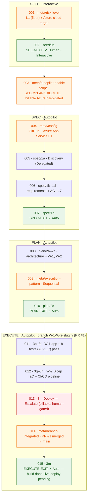

# Execution Diagram — Iteration-YVIVBU

> Derived from `Iteration-YVIVBU-execution-log.md` (15 entries) + the branch-scoped log. The logs are authoritative; this diagram may be regenerated from them at any time.

## Legend

- **Green** = stage-exit gate (with mode). **Orange** = `meta/*` entry. **Red** = `Escalate` (hard-guardrail stop).

## Flow summary

| Stage | Entries | Gate · outcome · mode |
|-------|---------|-----------------------|
| **SEED** | 001 (risk L1 + cloud), 002 | `SEED-EXIT` · Approved · **Human / Interactive** |
| **SPEC** | 003 (autopilot), 004 (config), 005–006 | `SPEC-EXIT` · Approved · **Autopilot** |
| **PLAN** | 008, 009 (Sequential) | `PLAN-EXIT` · Approved · **Autopilot** |
| **EXECUTE** | 011 (W-1), 012 (W-2), 013 (deploy Escalate), 014 (integrated) | `EXECUTE-EXIT` (015) · Approved · **Autopilot** |

## Work items

- **W-1** — slug logic + FastAPI endpoints + 8 tests (AC-1..7). Delivered.
- **W-2** — Bicep IaC + gated CI/CD pipeline. Delivered.

## Notes

- Autopilot authorized at **003** (scope SPEC/PLAN/EXECUTE); the three stage-exit gates self-approved with attribution, SEED stayed Interactive.
- **013 is the one `Escalate`** — the billable Azure provision/deploy is a hard guardrail, handed to the Human User (OIDC + `AZURE_READY` + secrets). The build is complete; only the live deploy (BR-3) is pending that gated setup.
